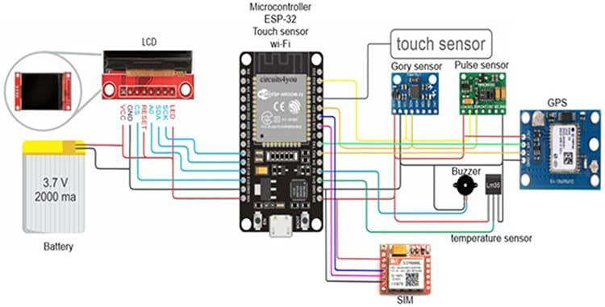

# Smart Wearable for Fall Detection 🚑⌚

A smart wearable device prototype designed to detect falls and monitor vital signs, built using ESP32 and multiple sensors.

## 📌 Features
- Fall detection with MPU6050
- SpO2 & heart rate monitoring using MAX30100
- Emergency alerts: buzzer, vibrator, LED
- Location tracking with GPS / Wi-Fi triangulation
- LCD display for real-time info

## 🛠 Hardware Used
- ESP32 microcontroller
- MPU6050 accelerometer & gyroscope
- MAX30100 pulse oximeter
- GPS module
- LCD display
- Buzzer & vibration motor
- TP4056 charging module
- Two 3.7V lithium-ion batteries

## 🧩 Circuit Diagram

## 🚀 Future Work
- Add data logging
- Integrate with mobile app
- Improve accuracy of fall detection

## 📂 Structure
- `firmware/` - Arduino/ESP32 code
- `images/` - Diagrams & photos
